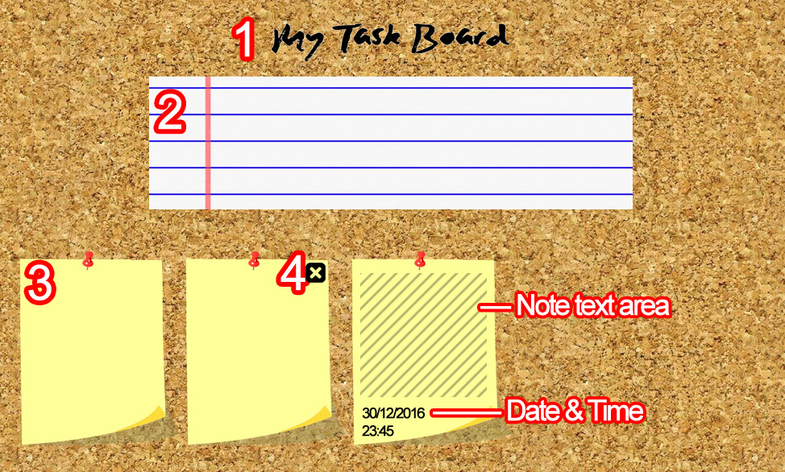

<h1 align="center" id="top">Task Board</h1>
<hr>

<div align="center" > 
  

  &#xa0;

</div>

<p align="center">
    <br>
    
    
    
    

</p>


<br>

## Features ##
 being able to see the task notes on the task board; \
 entering a new task note; \
 deleting the task/s;
## Requirements ##

[VS Code](https://code.visualstudio.com/) and [Live Server](https://marketplace.visualstudio.com/items?itemName=ritwickdey.LiveServer).

## How to Start ##

```bash
# Clone this project
$ git clone https://github.com/odaiwa/Task-Board
$ code .

```

After opening the folder in VS Code , right click on the index.html folder and then click on open with live server.
